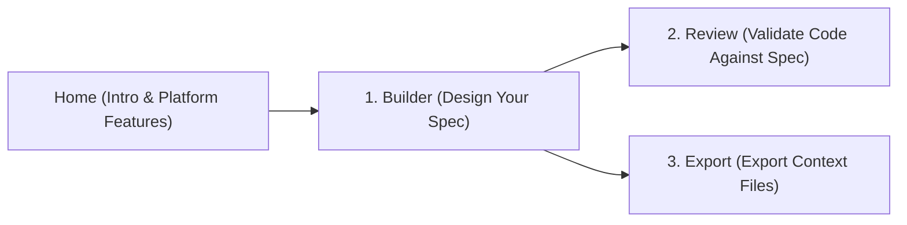

# SecureCon — Project Context & Best Practices Documentation

SecureCon bridges the gap between your security standards, legal compliance, and AI code generation. By turning these rules into structured markdown and export files, any AI agent (Claude, Cursor, Windsurf) can inherit the complete technical and security context of your project.

---

## 1. Terminology & Platform Definitions

To get the most out of SecureCon, it helps to understand its core terms:

### A. Project Spec
A complete definition of your project's identity, technical stack, security requirements, code quality patterns, and legal obligations.
- **Identity**: The name and purpose of your codebase.
- **Stack**: The programming languages, frameworks, and tools used.

### B. Test Functions
Small, specific, and named rules (e.g., `no_client_secrets`) that define what the AI must pass. In the Code Review tab, Claude checks the input code specifically against these functions.

### C. Context Output
The fully formatted system prompt text that combines the project's spec, rules, and tests. This text is optimized to be understood directly by LLMs.

---

## 2. Navigating the SecureCon Platform

Moving around the platform is straightforward, with a focus on simplicity:

### 1. Home (`/`)
An intro to the capabilities of the SecureCon platform, highlighting the default security, quality, and legal rules built right in.

### 2. Builder (`/builder`)
- **Bootstrap from Preset**: Select from curated templates like Next.js, React, Node.js, or Fintech to instantly populate requirements.
- **Configure Custom Rules**: Toggle exact security, quality, and legal features on or off.
- **Add Tests**: Describe exactly what your AI agent should check for.
- **Evaluation**: See your readiness score (0–100%) in real-time before generating your context.

### 3. Review (`/review`)
Paste a module or upload a file to evaluate it against your spec.
- Enter your **Anthropic API Key** to power tests via Claude.
- **Your Privacy Guarantee**: The key stays securely in your browser's local storage. It is never logged on our server.

### 4. Export (`/export`)
Download your project's context in multiple formats:
- `spec.json`: Share with teammates to continue working on SecureCon.
- `AI_CONTEXT.md`: Use in Claude Projects or as your starting system prompt.
- `.cursorrules` / `AGENTS.md`: Add to your project root to align Cursor or Windsurf automatically.

---

## 3. Best Practices: Prompting AI Tools for Standard Websites

When using SecureCon outputs or prompting AI agents to help build high-standard web apps, use these actionable tips:

### Tip 1: Establish Strict Ground Rules
Begin your initial prompt by feeding your SecureCon `AI_CONTEXT.md` file to the AI or pasting it directly into custom project instructions.
*Example prompt:*
> "You are an expert full-stack developer. Read this context file and adhere strictly to the security, quality, and test functions outlined in it on every file creation or edit."

### Tip 2: Reject Placeholders and TODOs
AI agents often leave placeholders or unfinished code. Explicitly instruct the AI to write complete, fully functional files.
*Example prompt:*
> "Write the complete, drop-in replacement file content without omitting code or leaving TODO comments."

### Tip 3: Mandate a Design System
When building web applications, ask the AI to strictly enforce your styling design system and utility classes instead of using ad-hoc styling.
*Example prompt:*
> "Update this component to match the styling design tokens, font family, and premium micro-animations defined in my existing `globals.css` file."

### Tip 4: Iterative Evaluation & Continuous Guardrails
Before deploying or committing new code, paste it back into the **SecureCon Review** tab to verify that the AI followed your spec completely without introducing security regressions.
